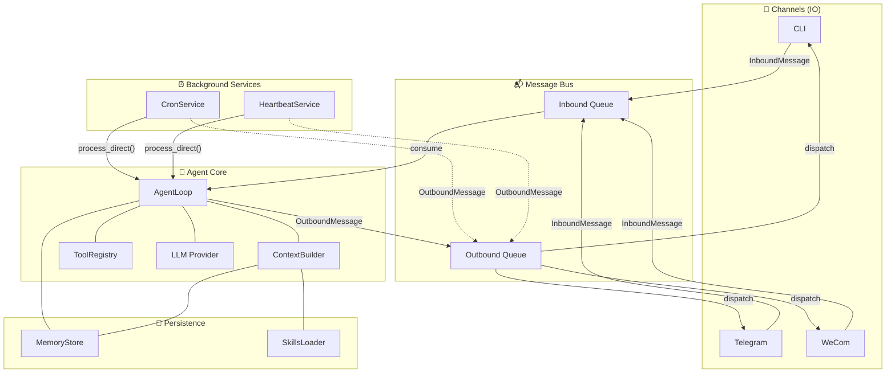
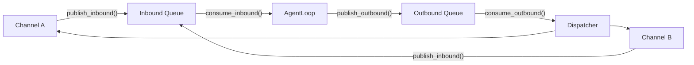
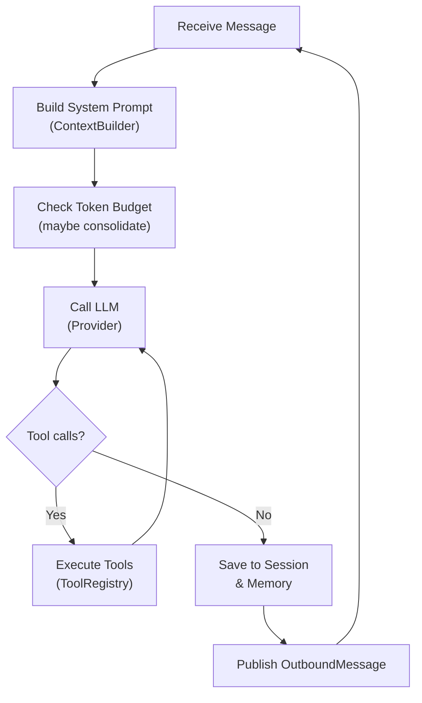
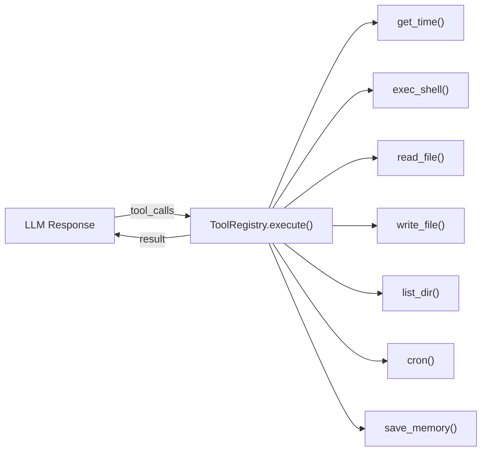
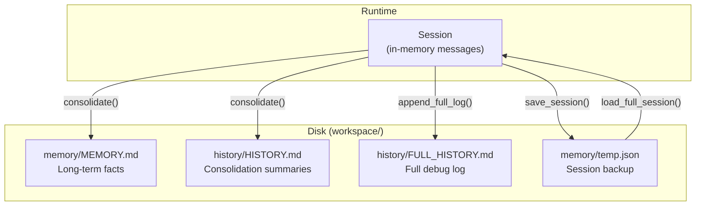
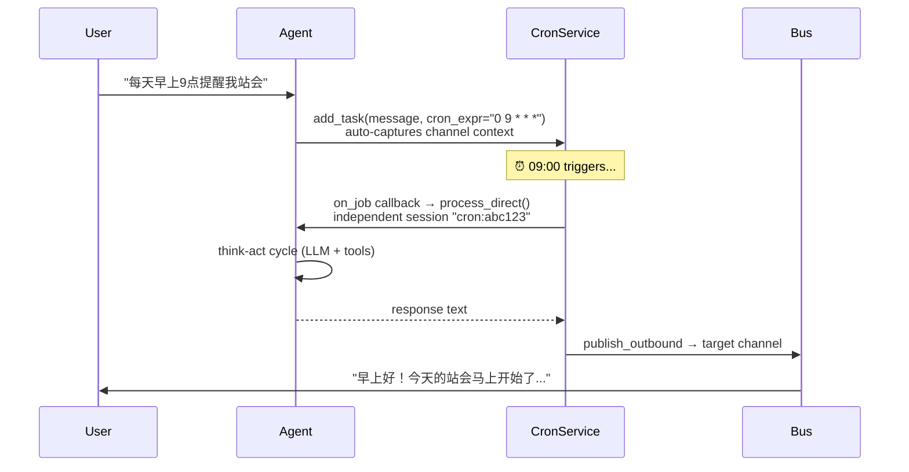
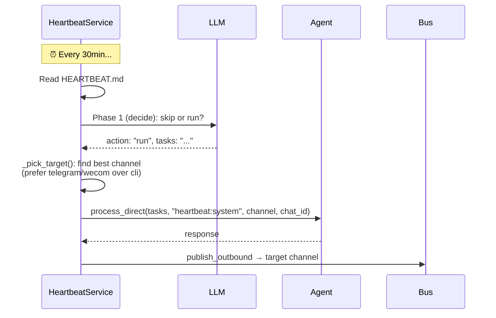
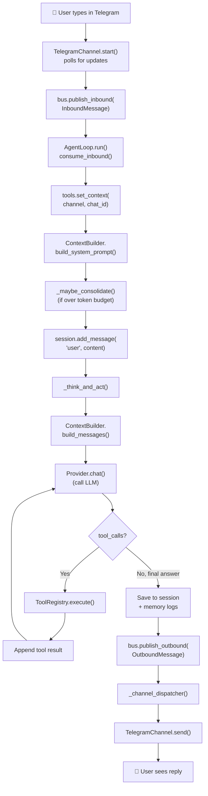
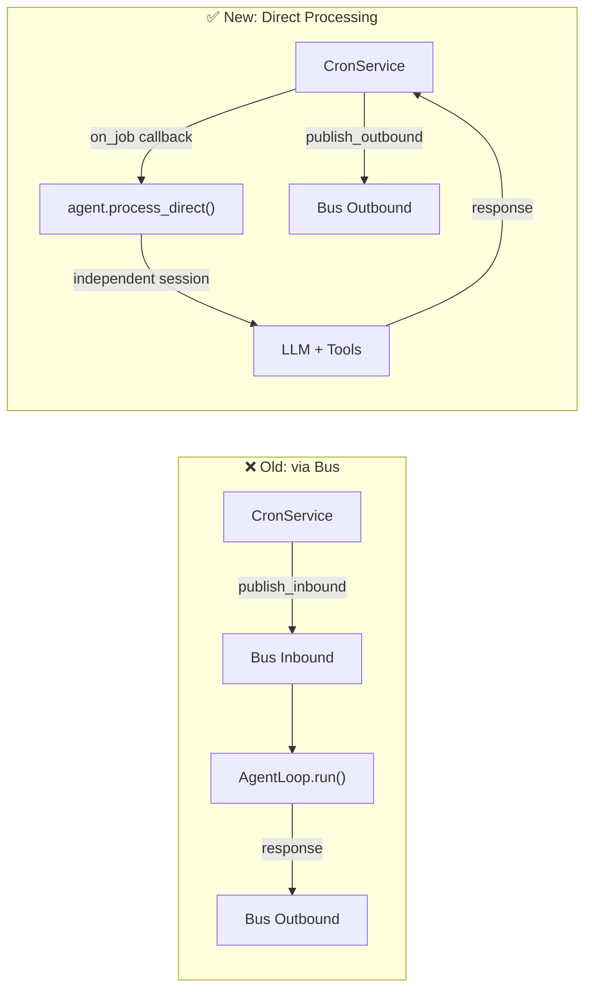

# SimpleClaw 🦞

A simplified, easy-to-understand AI agent framework — designed for learning and light use.

This build is derived from and inspired by the following independent projects:

* **[OpenClaw](https://github.com/OpenClaw/OpenClaw)**: The open-source AI assistant and automation platform.
* **[Nanobot](https://github.com/HKUDS/nanobot)**: The modular execution engine that serves as the technical backbone for this simplified version.

---

## Table of Contents

- [Quick Start](#quick-start)
- [Architecture Overview](#architecture-overview)
- [Project Structure](#project-structure)
- [Core Concepts](#core-concepts)
  - [Message Bus](#1-message-bus-buspy)
  - [Channels](#2-channels-channelspy)
  - [Agent Loop](#3-agent-loop-agentpy)
  - [Tools](#4-tools-toolspy)
  - [Memory](#5-memory-memorypy)
  - [Context Builder](#6-context-builder-contextpy)
  - [Skills](#7-skills-skillspy)
  - [Cron Service](#8-cron-service-cronpy)
  - [Heartbeat Service](#9-heartbeat-service-heartbeatpy)
- [Message Lifecycle](#message-lifecycle)
- [Cron & Heartbeat: Direct Processing](#cron--heartbeat-direct-processing)
- [Session Management](#session-management)
- [Configuration](#configuration)
- [Development](#development)

---

## Quick Start

### Setup with uv

1. Install [uv](https://github.com/astral-sh/uv).
2. Install dependencies:
   ```bash
   uv sync
   ```
3. Run the agent:
   ```bash
   uv run python main.py
   ```

### Setup with pip (Standard)

1. (Optional) Create a virtual environment:
   ```bash
   python -m venv venv
   # Windows
   .\venv\Scripts\activate
   # Linux/Mac
   source venv/bin/activate
   ```
2. Install dependencies:
   ```bash
   pip install -r requirements.txt
   ```
3. Run the agent:
   ```bash
   python main.py
   ```

### Docker

```bash
docker compose up --build
```

---

## Architecture Overview

SimpleClaw follows a **Bus-driven, Channel-Agent-Tool** architecture. All communication flows through a central message bus, keeping IO (channels) cleanly separated from logic (agent).



---

## Project Structure

```
SimpleClaw/
├── main.py                  # Entry point, wires all components and starts services
├── core/
│   ├── bus.py               # Message bus with Inbound/Outbound async queues
│   ├── agent.py             # AgentLoop: think-act cycle + process_direct
│   ├── provider.py          # LLM backends (OpenAI/OpenRouter + Mock)
│   ├── tools.py             # ToolRegistry + built-in tools (exec, read, write...)
│   ├── memory.py            # MemoryStore + Session + LLM-driven consolidation
│   ├── context.py           # ContextBuilder: assembles system prompt and messages
│   ├── skills.py            # SkillsLoader: discovers SKILL.md definitions from disk
│   ├── config.py            # ConfigLoader with dataclass-based configuration
│   ├── cron.py              # CronService: scheduled task execution
│   ├── heartbeat.py         # HeartbeatService: periodic background checks
│   └── channels/
│       ├── base.py          # Abstract BaseChannel interface
│       ├── cli.py           # CLI channel (stdin/stdout)
│       ├── telegram.py      # Telegram Bot channel
│       └── wecom.py         # WeCom channel
├── workspace/               # Runtime data (mounted as volume in Docker)
│   ├── config.json          # Runtime configuration
│   ├── SOUL.md              # Agent identity and personality
│   ├── USER.md              # User context and preferences
│   ├── TOOLS.md             # Tool usage guidelines
│   ├── AGENTS.md            # Sub-agent registry
│   ├── HEARTBEAT.md         # Background tasks for heartbeat
│   ├── memory/
│   │   ├── MEMORY.md        # Long-term memory (overwritten on consolidation)
│   │   └── temp.json        # Session persistence backup
│   ├── history/
│   │   ├── HISTORY.md       # Consolidation summaries (append-only)
│   │   └── FULL_HISTORY.md  # Full debug log
│   └── skills/              # Skill definitions (SKILL.md per subfolder)
├── template/                # Default files copied into workspace on first run
├── skills/                  # Built-in skill definitions (copied to workspace)
├── configs/                 # Configuration templates
└── reference/               # Nanobot reference implementation
```

---

## Core Concepts

### 1. Message Bus (`bus.py`)

The **MessageBus** is two async queues that decouple all IO from the agent:



- **InboundMessage**: `channel` + `chat_id` + `content` + `metadata`
- **OutboundMessage**: `channel` + `chat_id` + `content` + `metadata`

Every channel uses the same message format, so the agent doesn't need to know *which* platform a message came from.

### 2. Channels (`channels/`)

Channels are the agent's "senses" — they bridge external platforms to the bus:

| Channel | Role | File |
|---------|------|------|
| **CLI** | stdin/stdout for local development | `channels/cli.py` |
| **Telegram** | Telegram Bot API polling | `channels/telegram.py` |
| **WeCom** | 企业微信 webhook | `channels/wecom.py` |

All channels extend `BaseChannel` which requires two methods:
- `start()` — listen for incoming messages, publish to `bus.inbound`
- `send(msg)` — deliver an outbound message to the platform

### 3. Agent Loop (`agent.py`)

The **AgentLoop** is the brain. It runs the **think-act cycle**:



Key methods:
- **`run()`** — main loop, consumes from bus inbound
- **`process_direct(content, session_key, channel, chat_id)`** — direct invocation (used by cron/heartbeat), bypasses the bus entirely
- **`_think_and_act()`** — inner LLM loop: call → tools → call → ... → final answer
- **`_maybe_consolidate()`** — shrinks context when token budget exceeded

### 4. Tools (`tools.py`)

The **ToolRegistry** manages callable functions exposed to the LLM:



The registry also holds **channel context** (`set_context(channel, chat_id)`), which tools like `cron` read from automatically — eliminating the need for the LLM to manually pass routing parameters.

### 5. Memory (`memory.py`)

Two-layer persistent memory system:



**Consolidation flow**: When session tokens exceed the budget, old messages are summarized by the LLM into `MEMORY.md` (facts) + `HISTORY.md` (timeline), then removed from the active session.

### 6. Context Builder (`context.py`)

Assembles everything the LLM needs to see:

```
System Prompt = Identity + Bootstrap Files + Memory + Skills
                   │            │              │         │
                   │    SOUL.md, USER.md       │    Available skills
                   │    TOOLS.md, AGENTS.md    │    summary + always-on
                   │    HEARTBEAT.md           │    skill content
                   │                      MEMORY.md
                   │
              Runtime info, workspace paths,
              platform policy, guidelines
```

Each turn, the **last user message** is prepended with runtime context (current time, channel, chat_id) so the LLM always knows *when* and *where* it's responding.

### 7. Skills (`skills.py`)

Skills are **markdown-defined capabilities** that extend the agent without code changes:

```
workspace/skills/
├── cron/
│   └── SKILL.md          # Frontmatter (name, description) + instructions
├── memory/
│   └── SKILL.md
├── weather/
│   └── SKILL.md
└── ...
```

The `SkillsLoader` reads all `SKILL.md` files, parses frontmatter, and injects summaries into the system prompt. Skills marked `always: true` have their full content loaded every turn.

### 8. Cron Service (`cron.py`)

Scheduled task execution with a **callback pattern**:



Key design choices:
- **Auto-context capture**: When adding a task, `target_channel` and `target_chat_id` are captured from `ToolRegistry._context` — LLM doesn't need to guess
- **Callback pattern**: Tasks fire via `on_job` callback → `agent.process_direct()`, not through the inbound bus
- **Independent sessions**: Each task gets its own session (`cron:{task_id}`) to avoid polluting user conversations

### 9. Heartbeat Service (`heartbeat.py`)

Periodic background check with **smart target selection**:



- **Two-phase design**: Phase 1 is a cheap LLM call (skip/run decision). Phase 2 only runs if there are active tasks.
- **Smart target**: Scans active sessions to find the best external channel (Telegram, WeCom). Falls back to CLI.

---

## Message Lifecycle

Here is the complete journey of a user message through the system:



---

## Cron & Heartbeat: Direct Processing

Cron and Heartbeat use **`process_direct()`** instead of publishing to the inbound bus. This solves the core problem: messages pushed to `bus.inbound` would compete with user messages and responses could be lost or misrouted.



Benefits:
1. **No bus contention** — cron/heartbeat don't compete with user messages
2. **Independent sessions** — each task has its own conversation history
3. **Correct routing** — responses go to the right channel every time
4. **Caller controls delivery** — the callback decides *how* and *where* to publish

---

## Session Management

Sessions are keyed by `"channel:chat_id"` and stored in `AgentLoop._sessions`:

| Session Key | Source | Purpose |
|-------------|--------|---------|
| `cli:user1` | CLI input | Primary interactive session |
| `telegram:12345` | Telegram user | Per-user Telegram session |
| `wecom:zhang_san` | WeCom user | Per-user WeCom session |
| `cron:abc123` | CronService | Isolated per-task session |
| `heartbeat:system` | HeartbeatService | Heartbeat processing session |

The primary session (`cli:user1`) is persisted to `temp.json` and restored on restart. Cron/heartbeat sessions are ephemeral.

---

## Configuration

Copy and edit the config file:

```bash
cp configs/config.example.json workspace/config.json
```

Key configuration sections:

```jsonc
{
  "llm": {
    "provider": "openrouter",
    "api_key": "sk-...",              // Your OpenRouter API key
    "model": "openai/gpt-4o-mini",    // Any OpenRouter model
    "base_url": "https://openrouter.ai/api/v1"
  },
  "agent": {
    "name": "SimpleClaw",
    "system_prompt": "",               // Optional extra instructions
    "max_loops": 10                    // Max tool-call rounds per message
  },
  "heartbeat": {
    "enabled": true,
    "interval_s": 1800                 // Check HEARTBEAT.md every 30 min
  },
  "telegram": {
    "enabled": false,
    "token": "",                       // Telegram Bot token
    "allowed_user_ids": []             // Empty = accept all
  },
  "wecom": {
    "enabled": false,
    "bot_id": "",
    "secret": ""
  }
}
```

---

## Development

- Add dependencies: `uv add <package>`
- Update dependencies: `uv lock --upgrade`
- Update `requirements.txt`: `uv export --format requirements-txt -o requirements.txt`

### Adding a new Channel

1. Create `core/channels/my_channel.py` extending `BaseChannel`
2. Implement `start()` (listen → `bus.publish_inbound`) and `send(msg)` (deliver outbound)
3. Wire it in `main.py` and add to `_channel_dispatcher()`

### Adding a new Tool

1. Write the function in `core/tools.py`
2. Register it in `setup_tools()` with name, description, and JSON Schema parameters
3. The LLM will automatically discover and use it

### Adding a new Skill

1. Create `workspace/skills/my-skill/SKILL.md` with frontmatter:
   ```markdown
   ---
   name: my-skill
   description: What this skill does
   ---
   Instructions for the agent...
   ```
2. The agent discovers it automatically on next startup
